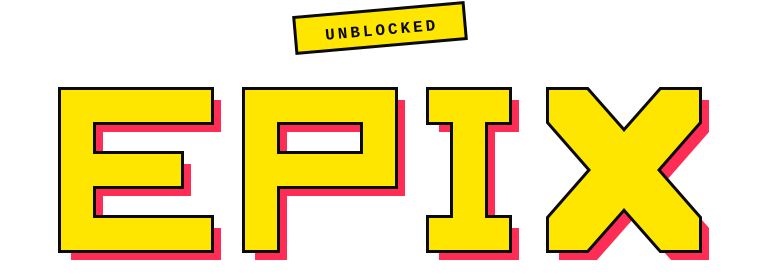

# Epix Unblocked



A curated collection of browser games built with Next.js and designed to be easy to browse, launch, and extend.

[Live site](https://epixunblocked.github.io/)

## Overview

Epix Unblocked is a static gaming portal that organizes playable web games, thumbnails, and supporting UI into a fast, lightweight site. The project is structured so new games can be added with minimal effort, while the site itself remains simple to build and deploy.

## Features

- Game catalog with thumbnail-driven browsing
- Dedicated game pages for embedded or hosted HTML games
- Lightweight Next.js frontend
- Static content generation for sitemap and thumbnail metadata
- Simple workflow for adding new games

## Getting Started

### Prerequisites

- Node.js 18 or newer
- npm

### Install

```bash
npm install
```

### Run locally

```bash
npm run dev
```

The site will start in development mode and regenerate generated assets automatically.

### Build for production

```bash
npm run build
```

## Available Scripts

- `npm run dev` - Generate assets and start the Next.js development server
- `npm run build` - Generate assets and create a production build
- `npm run start` - Start the production server
- `npm run new:game` - Scaffold a new game entry
- `npm run gen` - Run all generated asset tasks
- `npm run gen:thumbnails` - Generate the thumbnail map
- `npm run gen:sitemap` - Generate the sitemap

## Adding a Game

1. Create a new folder in `public/html/` for the game.
2. Add the game's `index.html` and any supporting files to that folder.
3. Add a thumbnail image for the game in `public/thumbnails/`.
4. Update the game entry in `data/games.js` so it appears in the catalog.

If the project uses the scaffold script, you can also start with:

```bash
npm run new:game
```

## Project Structure

- `components/` - Reusable UI components
- `context/` - Shared React context
- `data/` - Game, tag, and cloak metadata
- `pages/` - Next.js routes and page components
- `public/html/` - Game HTML content
- `public/` - Static assets, sitemap, robots, and service worker files
- `scripts/` - Asset generation and scaffolding utilities
- `styles/` - Global and module CSS

## License

Licensed under the MIT License.
